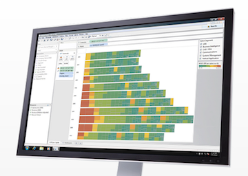
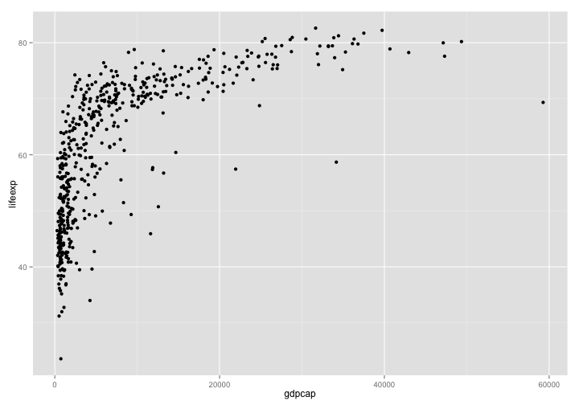
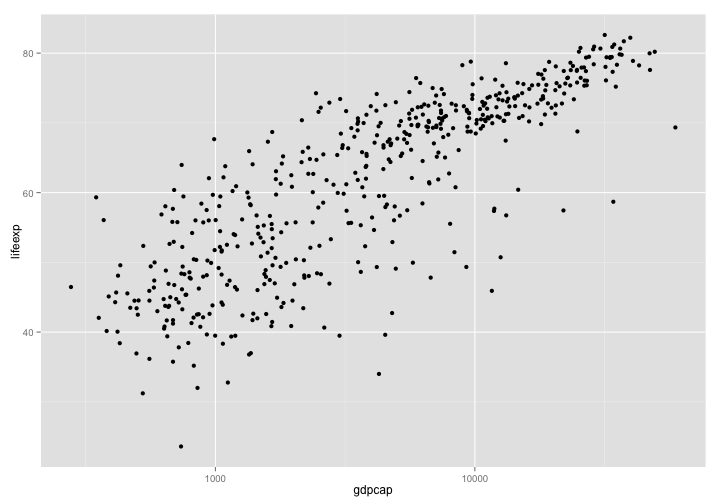

DataVis LA Intro
========================================================

Szilárd Pafka, PhD <br>
Chief Scientist, Epoch

DataVis LA meetup <br>
Nov 2013


========================================================


========================================================


========================================================


========================================================


========================================================


========================================================


========================================================


========================================================





========================================================


========================================================


========================================================


```r
x <- 1:4
gr <- c("a","a","b","b")
y <- x + rnorm(4)
d <- data.frame(gr, x, y)
print(d)
```

```
  gr x      y
1  a 1 0.6412
2  a 2 2.7852
3  b 3 1.7314
4  b 4 5.9027
```

```r
md <- lm(y ~ x, d)
```


========================================================


========================================================


========================================================


<br>

```r
d <- read.csv("data/gapminder.csv", sep="\t")
```


<br>
- Country
- Year
- Population
- Continent
- Life expectancy
- GDP per capita


========================================================


```r
ggplot() + geom_point(data = d, mapping = aes(x = gdpcap, y = lifeexp))
```

 


========================================================


```r
ggplot(d) + geom_point(aes(x = gdpcap, y = lifeexp)) + scale_x_log10()
```

 


========================================================


```r
ggplot(d) + geom_point(aes(x = gdpcap, y = lifeexp, color = contin)) + scale_x_log10()
```

 


========================================================


```r
ggplot(d) + geom_point(aes(x = gdpcap, y = lifeexp, color = contin, size = pop)) + scale_x_log10()
```

 


========================================================


```r
ggplot(d) + geom_point(aes(x = gdpcap, y = lifeexp, color = contin, size = pop)) + scale_x_log10() + scale_size(range = c(2,10))
```

 


========================================================


```r
ggplot(d) + geom_point(aes(x = gdpcap, y = lifeexp, color = contin, size = pop)) + scale_x_log10() + scale_size(range = c(2,10)) + facet_wrap( ~ yr)
```

 


========================================================

 


